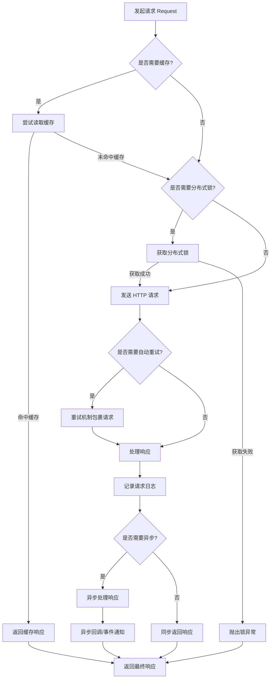

# HttpClientBundle 工作流程（Mermaid）

```mermaid
flowchart TD
    A[发起请求 Request] --> B{是否需要缓存?}
    B -- 是 --> C[尝试读取缓存]
    C -- 命中缓存 --> Z[返回缓存响应]
    C -- 未命中缓存 --> D{是否需要分布式锁?}
    B -- 否 --> D
    D -- 是 --> E[获取分布式锁]
    E -- 获取成功 --> F[发送 HTTP 请求]
    E -- 获取失败 --> Y[抛出锁异常]
    D -- 否 --> F
    F --> G{是否需要自动重试?}
    G -- 是 --> H[重试机制包裹请求]
    G -- 否 --> I[处理响应]
    H --> I
    I --> J[记录请求日志]
    J --> K{是否需要异步?}
    K -- 是 --> L[异步处理响应]
    K -- 否 --> M[同步返回响应]
    L --> N[异步回调/事件通知]
    M --> O[返回最终响应]
    N --> O
    Z --> O
    Y --> O
```

> 该流程图描述了 HttpClientBundle 在处理一次 HTTP 请求时的主要决策与执行流程，包括缓存、分布式锁、重试、日志、异步等关键环节。
